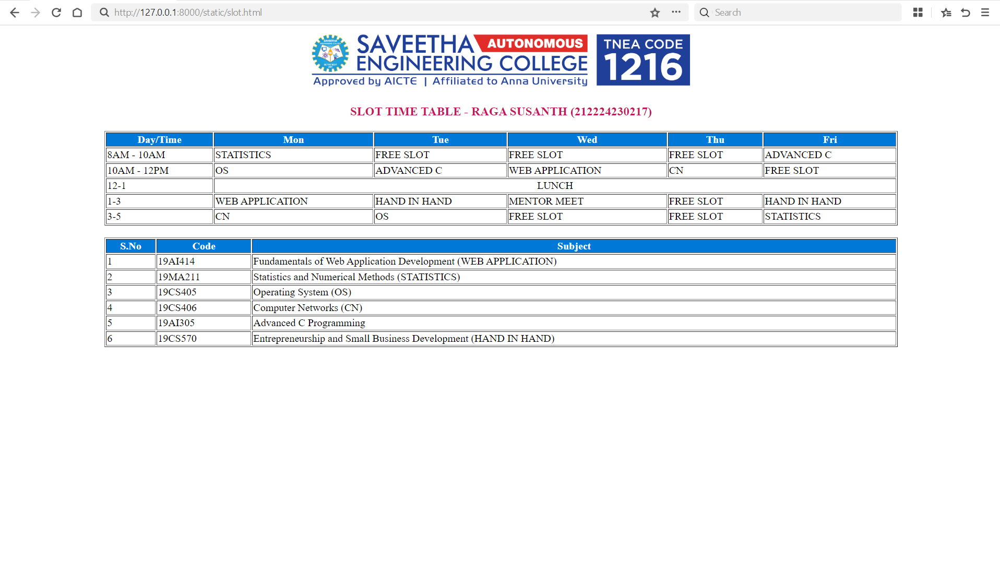

# Ex03 Time Table
## Date: 01/10/2025

## AIM
To write a html webpage page to display your slot timetable.

## ALGORITHM
### STEP 1
Create a Django-admin Interface.

### STEP 2
Create a static folder and inert HTML code.

### STEP 3
Create a simple table using ```<table>``` tag in html.

### STEP 4
Add header row using ```<th>``` tag.

### STEP 5
Add your timetable using ```<td>``` tag.

### STEP 6
Execute the program using runserver command.

## PROGRAM
```
<!DOCTYPE html>
<html>
<head>
  <title>Semester Timetable</title>
</head>
<body>

<div align="center">
  
</div>

<h3 align="center">
  <font color="#C2185B">SLOT TIME TABLE - RAGA SUSANTH (212224230217)</font>
</h3>

<table border="1" align="center" width="80%">
  <tr bgcolor="#0078D7">
    <th><font color="white">Day/Time</font></th>
    <th><font color="white">Mon</font></th>
    <th><font color="white">Tue</font></th>
    <th><font color="white">Wed</font></th>
    <th><font color="white">Thu</font></th>
    <th><font color="white">Fri</font></th>
  </tr>
  <tr>
    <td>8AM - 10AM</td>
    <td>STATISTICS</td>
    <td>FREE SLOT</td>
    <td>FREE SLOT</td>
    <td>FREE SLOT</td>
    <td>ADVANCED C</td>
  </tr>
  <tr>
    <td>10AM - 12PM</td>
    <td>OS</td>
    <td>ADVANCED C</td>
    <td>WEB APPLICATION</td>
    <td>CN</td>
    <td>FREE SLOT</td>
  </tr>
  <tr>
    <td>12-1</td>
    <td colspan="5" align="center">LUNCH</td>
  </tr>
  <tr>
    <td>1-3</td>
    <td>WEB APPLICATION</td>
    <td>HAND IN HAND</td>
    <td>MENTOR MEET</td>
    <td>FREE SLOT</td>
    <td>HAND IN HAND</td>
  </tr>
  <tr>
    <td>3-5</td>
    <td>CN</td>
    <td>OS</td>
    <td>FREE SLOT</td>
    <td>FREE SLOT</td>
    <td>STATISTICS</td>
  </tr>
</table>

<br>

<table border="1" align="center" width="80%">
  <tr bgcolor="#0078D7">
    <th><font color="white">S.No</font></th>
    <th><font color="white">Code</font></th>
    <th><font color="white">Subject</font></th>
  </tr>
  <tr>
    <td>1</td>
    <td>19AI414</td>
    <td>Fundamentals of Web Application Development (WEB APPLICATION)</td>
  </tr>
  <tr>
    <td>2</td>
    <td>19MA211</td>
    <td>Statistics and Numerical Methods (STATISTICS)</td>
  </tr>
  <tr>
    <td>3</td>
    <td>19CS405</td>
    <td>Operating System (OS)</td>
  </tr>
  <tr>
    <td>4</td>
    <td>19CS406</td>
    <td>Computer Networks (CN)</td>
  </tr>
  <tr>
    <td>5</td>
    <td>19AI305</td>
    <td>Advanced C Programming</td>
  </tr>
  <tr>
    <td>6</td>
    <td>19CS570</td>
    <td>Entrepreneurship and Small Business Development (HAND IN HAND)</td>
  </tr>
</table>

</body>
</html>

```
## OUTPUT



## RESULT
The program for creating slot timetable using basic HTML tags is executed successfully.
